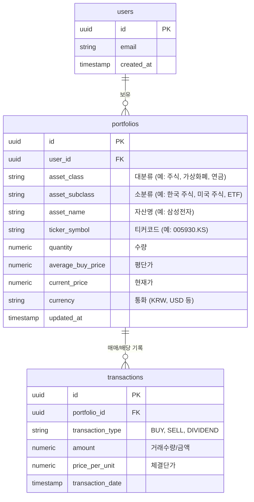
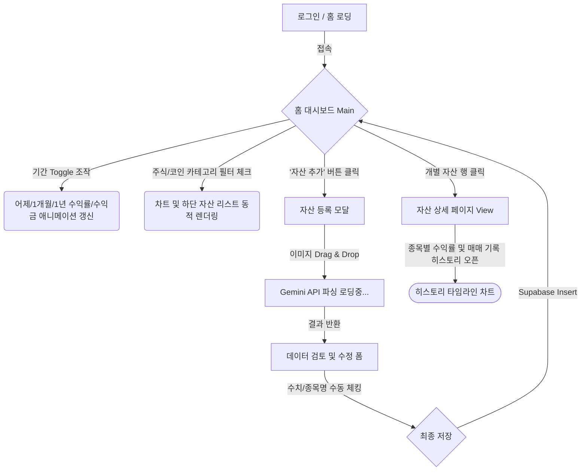

# 자산 관리 대시보드 PRD & 기술 스펙 (v1.0)

## 1. 프로젝트 개요
개인의 다양한 핵심 자산군을 통합적으로 관리하고, 시각적으로 우수한 UI를 통해 자산 현황과 수익률을 파악할 수 있는 로컬 우선(Phase 1) 및 서버 확장형(Phase 2) 대시보드 애플리케이션 구축.

## 2. 주요 대상 자산군
*   **주식** (국내)
*   **해외 주식**
*   **가상화폐**
*   **IRP** (개인형 퇴직연금)
*   **ISA** (개인종합자산관리계좌)
*   **연금저축**

## 3. 핵심 기능 요구사항

### 3.1. 대시보드 홈 (Dashboard)
*   **어제보다 얼마나 벌었을까? (기간별 수익 요약)**: 총 자산 가액과 함께, 상단에 **[어제, 1주, 2주, 1개월, 3개월, 6개월, 1년, 2년, 3년, 전체]** 기간 선택 Toggle 버튼 세트 제공. 버튼 클릭 시 해당 기간 동안의 **+수익금(원)** 및 **수익률(%)**이 즉시 계산되어 전환 애니메이션과 함께 표시됨.
*   **계층형 카테고리 필터링 (Interactive View)**: 대분류(주식, 코인 등) 및 소분류(한국 전주, 미국 주식, ETF 등) 체크박스 제공. 필터 체크 시 화면 내 모든 데이터(총 자산 명세, 차트, 요약 카드)가 해당 카테고리 기준으로 동적 즉시 갱신 (Supabase Realtime 기반).
*   **자산 비중 조회**: 전체 자산 중 각 항목별 비율 시각화 (선택된 카테고리에 연동 반응하는 도넛형/파이형 차트)
*   **변동 추이 그래프**: 기간별 자산 변동 추적 선 그래프 (필터 연동)

### 3.2. 자산 등록 및 AI 인식 기능 (AI Input Mechanism)
*   **방식**: AI 이미지 인식 기반의 반자동 기입 프로세스 구현.
    1.  **사진 첨부**: 사용자가 자산 내역(증권사/은행 앱 캡처 등) 이미지 업로드
    2.  **AI 자동 인식**: Gemini API(Vision 지원)를 활용하여 이미지 내 자산명, 단가, 수량, 평가금액 등 주요 데이터 파싱
    3.  **검토 및 수정**: 인식 오류 방지를 위해, 추출된 데이터를 사용자가 폼 형태로 검토하고 필요 시 수정
    4.  **최종 반영**: 확정된 데이터를 DB에 저장 및 대시보드 반영

### 3.3. 시나리오 및 확장 계획
*   **Phase 1 (로컬 기반)**: 로컬 PC 구동 환경 구축 (Python 기반 환경 구성, 로컬 DB 활용)
*   **Phase 2 (서버 구동)**: Cloud 서버 업로드, 인증 등 강화 및 멀티플랫폼 대응 준비

## 4. 아키텍처 및 추천 기술 스택 (Technical Stack & Architecture)
**최종 시스템 아키텍처: Supabase(BaaS) + React 기반**
*   **Backend (BaaS)**: **Supabase** (PostgreSQL 데이터베이스, Storage, Auth, Edge Functions)
*   **Frontend**: React (Vite 템플릿 사용) + TailwindCSS/ShadcnUI
*   **AI 연동 구조**: Frontend에서 자산/계좌 이미지를 Supabase Storage에 업로드 -> Edge Function(서버리스)으로 Gemini API 실행 -> 결과물(JSON) 파싱 후 Supabase DB 저장
*   **종가 조회 방식**: Supabase Edge Functions(Deno환경)를 활용해 매일 지정된 시간(Cron)에 주식 종가를 스크래핑(예: Yahoo Finance API 호출)하고 DB를 갱신
*   *장점*: **과금 요소 0원(Free-tier 제공량 매우 넉넉함)**, 서버 인프라 유지 비용 제로, 강력한 RDB(관계형 DB) 및 실시간(Realtime) 구독 지원.

### 4.1. 데이터베이스 스키마(ERD) 초안
Supabase(PostgreSQL) 내부에 구성될 핵심 데이터 엔티티(테이블) 설계입니다.

## 5. UI/UX 화면 흐름도 (Screen Flow & Wireframe)
대시보드의 핵심 화면 라우팅과 사용자 행동(Action) 흐름입니다. 디자이너 에이전트가 제시하는 기초 플로우입니다.

### 5.1. 디자인 원칙 (Design Principles)
사용자 피드백("공백 최소화, 한 화면에 더 많은 정보 노출")을 적극 반영하여 대시보드의 메인 테마를 **High-Density (고밀도 데이터 중심) UI**로 재설계합니다.
*   **Zero-Wasted Space**: 브루탈리즘/미니멀리즘 특유의 낭비되는 아름다운 여백 대신, 블룸버그 터미널이나 전문가용 HTS, 바이낸스 Pro와 같이 화면 전체 그리드를 타이트하게 분할하여 씁니다.
*   **다중 컴포넌트 동시 노출**: 
    - (좌측 20%) 계층형 카테고리 트리 및 자산군 요약 
    - (중앙 50%) 메인 시계열 차트(캔들 차트, 이동평균선 등 전문적 뷰 지원) 및 세부 종목 리스트 
    - (우측 30%) AI 자산 등록 폼 트리거, 실시간 호가/트랜잭션(최근 거래 내역) 스트리밍 타워, 자산 비중 미니 도넛 차트
*   **가독성**: 데이터가 빼곡하더라도 피로도가 적도록 작은 폰트(Inter/Roboto)와 미세한 디바이더(선)만으로 영역을 구분하는 전문가용 '화이트(라이트) 모드' 테마를 유지합니다.

## 6. 개발 진행 프로세스 (Subagent 협업 시뮬레이션)
본 프로젝트는 각 분야 전문가(Subagent)의 역할을 논리적으로 분담하여 단계별로 완성도를 높여나갑니다.

1.  **🧑‍💼 요구사항 전문가 (Requirements Expert)**
    - *역할*: PRD 수립, 핵심 비즈니스 로직(자산 등록, AI 파싱 플로우) 구체화
    - *산출물*: 현재 문서(`PRD.md`), 시나리오 명세서
2.  **🏛️ 아키텍트 (Architect)**
    - *역할*: 시스템 아키텍처(Phase 1/2) 로드맵 설계, Database 스키마 구조, 기술 스택 최적화 확정
    - *산출물*: Backend 아키텍처 및 ERD(엔티티-관계 다이어그램) 초안
3.  **🎨 디자이너 (UI/UX Designer)**
    - *역할*: AI를 기반으로 대시보드의 사용성, 색상, 그리고 컴포넌트 구조를 기획합니다.
    - *활용 도구 (AI Tools)*:
      - `generate_image`: 다크/라이트 모드의 하이파이(Hi-Fi) 대시보드 시안 이미지 발췌
      - `Mermaid Graph`: 유저 플로우(User Flow) 스크린 라우팅 및 상태 설계
      - `TailwindCSS/Shadcn`: 프론트엔드 코드에 1:1 대응되는 컴포넌트 토큰 기반 설계
4.  **💻 프론트엔드/백엔드 개발자 (Frontend & Backend Developers)**
    - *역할*: 설계 문서를 바탕으로 코드베이스 셋업 (React & FastAPI), API 연동, 화면 구현
    - *산출물*: 실제 동작하는 Application 코드, Gemini API 연동 모듈
5.  **⚙️ DevOps & QE (Quality Engineering) 전문가**
    - *역할*: 로컬 서버 구동/빌드 설정, CI/CD 초안 작성(Phase 2), 테스트 케이스 셋업, QA(품질 검증)
    - *산출물*: `docker-compose` 혹은 `uv` 구동 스크립트, 단위/통합 테스트 스크립트 결함 리포트

## 7. 승인 필요 사항 및 논의점
> [!NOTE]
> 1. AI 인식을 위해 **Gemini API**를 사용할 예정입니다. 사용자 분의 환경에 맞게 로컬 `.env` 등으로 API 키를 세팅하고 진행하겠습니다.
> 2. 위 명시한 전문가 롤(Role) 시뮬레이션 플로우에 따라 각 직무별 담당자로서 문서를 생성하고 컨펌 받으며 넘어가도 괜찮으실까요? 

## 8. Verification Plan
*   Backend: FastAPI Swagger를 통해 AI 이미지 인식 엔드포인트 동작 확인 (이미지 업로드 -> 텍스트 파싱)
*   Frontend: 로컬 브라우저에서 대시보드 UI 확인 (차트 렌더링, 시각적 디자인 요소 확인)
